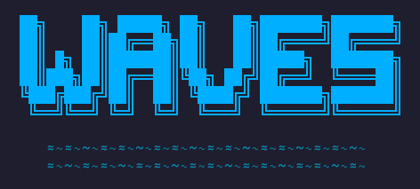
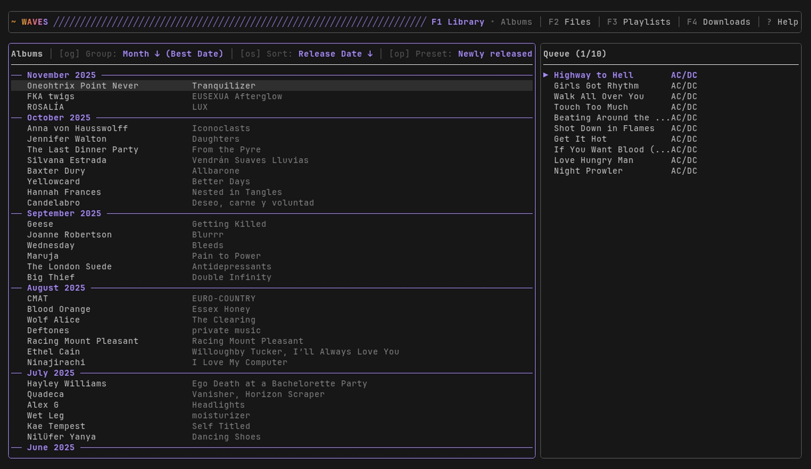

<p align="center">
  
</p>

<p align="center">
  
</p>

> **Note:** This project is in early development. Features may change and bugs are expected.

A terminal music player with library browsing and queue management.

## Features

- **Library Browser**: Browse music by Artist > Album > Track hierarchy
- **File Browser**: Navigate filesystem with file/folder deletion
- **Playlists**: Create, organize, and manage playlists with folder hierarchy
- **Favorites**: Quick-access playlist with heart icon display
- **Playing Queue**: Persistent queue with multi-selection, reordering, and undo/redo
- **Audio Playback**: MP3 and FLAC support with seeking
- **Full-Text Search**: SQLite FTS5 search across library, files, and playlists
- **Download Manager**: Search and download from Soulseek via slskd integration
- **Import System**: MusicBrainz tagging, file renaming, and library integration
- **Last.fm Scrobbling**: Track your listening history with offline queue support
- **Radio Mode**: Endless playback with Last.fm similar artists and intelligent track selection
- **Mouse Support**: Click to navigate, select tracks, and control playback
- **State Persistence**: Queue and navigation saved between sessions

## Installation

### Arch Linux (AUR)

```bash
yay -S waves-bin
```

### From Source

```bash
go install github.com/llehouerou/waves@latest
```

Requires Go 1.23+ and ALSA development libraries (`libasound2-dev` on Debian/Ubuntu, `alsa-lib` on Arch).

## Development

```bash
git clone https://github.com/llehouerou/waves.git
cd waves
make install-hooks  # Install git pre-commit hook
make run            # Run the app
```

## Controls

Press `?` at any time to show the keybinding help popup.

### Global

| Key | Action |
|-----|--------|
| `q` / `ctrl+c` | Quit |
| `Tab` | Switch focus (navigator / queue) |
| `p` | Toggle queue panel |
| `/` | Search current items |
| `?` | Show help |
| `ctrl+z` | Undo |
| `ctrl+shift+z` | Redo |

### View Switching

| Key | Action |
|-----|--------|
| `F1` | Library view |
| `F2` | File browser view |
| `F3` | Playlists view |
| `F4` | Downloads view |

### F-Sequence Commands

| Key | Action |
|-----|--------|
| `f` `f` | Deep search |
| `f` `r` | Refresh library (incremental) |
| `f` `R` | Full rescan library |
| `f` `p` | Library sources manager |
| `f` `d` | Download from Soulseek |
| `f` `l` | Last.fm settings |

### Playback

| Key | Action |
|-----|--------|
| `Space` | Play/pause |
| `s` | Stop |
| `v` | Toggle player display |
| `R` | Cycle repeat mode (off/all/one/radio) |
| `S` | Toggle shuffle |
| `Shift+Left/Right` | Seek -/+5 seconds |
| `Alt+Shift+Left/Right` | Seek -/+15 seconds |
| `PgDown` / `PgUp` | Next/previous track |
| `Home` / `End` | First/last track |

### Navigator

| Key | Action |
|-----|--------|
| `h` `j` `k` `l` / Arrows | Navigate |
| `Enter` | Play (replace queue) |
| `a` | Add to queue |
| `ctrl+a` | Add to playlist |
| `g` / `G` | First/last item |
| `ctrl+d` / `ctrl+u` | Half page down/up |

### Library (F1 view)

| Key | Action |
|-----|--------|
| `d` | Delete track |
| `F` | Toggle favorite |
| `V` | Toggle album view |
| `t` | Retag album |

### Album View Options

| Key | Action |
|-----|--------|
| `o` `g` | Album grouping |
| `o` `s` | Album sorting |
| `o` `p` | Album presets |

### File Browser (F2 view)

| Key | Action |
|-----|--------|
| `d` | Delete file/folder |

### Playlists (F3 view)

| Key | Action |
|-----|--------|
| `n` | Create new playlist |
| `N` | Create new folder |
| `ctrl+r` | Rename playlist/folder |
| `ctrl+d` | Delete playlist/folder |

### Playlist Track Editing

| Key | Action |
|-----|--------|
| `d` | Remove track |
| `J` / `K` | Move track down/up |

### Queue Panel

| Key | Action |
|-----|--------|
| `x` | Toggle selection |
| `d` / `Delete` | Delete selected |
| `c` | Clear except playing |
| `Shift+J` / `Shift+K` | Move selected down/up |
| `Enter` | Play track |
| `Esc` | Clear selection |
| `L` | Locate in navigator |
| `g` / `G` | First/last item |
| `ctrl+d` / `ctrl+u` | Half page down/up |

## Configuration

Copy `config.example.toml` to `~/.config/waves/config.toml` or `./config.toml`.

```toml
# Default folder to open on startup (supports ~)
default_folder = "~/Music"

# Icon style: "nerd" (Nerd Font), "unicode" (emoji), "none" (text)
icons = "nerd"

# slskd integration for downloading music from Soulseek
[slskd]
url = "http://localhost:5030"
apikey = "your-api-key-here"

[slskd.filters]
format = "both"       # "both", "lossless", or "lossy"
no_slot = true        # Filter out users with no free upload slot
track_count = true    # Filter results with fewer tracks than expected

[musicbrainz]
albums_only = true    # Filter to show only albums (not singles/EPs)

# Last.fm scrobbling (get API key at https://www.last.fm/api/account/create)
[lastfm]
api_key = "your-api-key"
api_secret = "your-api-secret"
```

### Library Sources

Library sources are managed in-app using `f p` in the library view (F1). This opens a popup where you can add, remove, and view source paths. Sources are persisted in the database, not the config file.

### Download Manager

The download manager requires a running [slskd](https://github.com/slskd/slskd) instance. Configure the URL and API key in `config.toml`, then use `f d` to open the download popup. Search for artists/albums, select a release from MusicBrainz, and download matching results from Soulseek. Downloaded files can be imported with MusicBrainz tagging and Picard-compatible file renaming.

### Last.fm Scrobbling

Scrobble your listening history to [Last.fm](https://www.last.fm). Create an API account at [last.fm/api/account/create](https://www.last.fm/api/account/create), add the credentials to `config.toml`, then link your account with `f l`. Tracks are scrobbled after 50% of playback or 4 minutes, whichever comes first. Failed scrobbles are queued and retried automatically.

### Radio Mode

Radio mode provides endless playback by automatically adding tracks from similar artists to your queue. It uses the Last.fm API to find artists similar to what you're currently playing, then selects tracks from your local library.

**Requirements:**
- Last.fm API credentials configured in `config.toml` (same as scrobbling)
- A populated music library with indexed artists

**Usage:**
1. Start playing any track from your library
2. Press `R` to cycle repeat modes until you see the radio icon (📻)
3. The queue will automatically fill with related tracks as you listen

**How it works:**
- Finds similar artists via Last.fm API based on the currently playing artist
- Matches similar artists to your local library using fuzzy matching
- Scores tracks based on popularity, your listening history, and artist similarity
- Enforces variety by limiting artist repetition and preventing oscillation patterns
- Caches API responses locally to reduce network requests

**Configuration options:**

```toml
[radio]
# Queue behavior
buffer_size = 1              # Tracks to queue ahead (1-20)

# Artist selection
similar_artists_limit = 50   # Similar artists to fetch from API
shuffle_pool_size = 10       # Top N artists to shuffle from
artists_per_fill = 5         # Artists to use per fill after shuffle
artist_match_threshold = 0.8 # Fuzzy match threshold (0.0-1.0)

# Variety enforcement
max_artist_repeat = 2        # Max times same artist in window
artist_repeat_window = 20    # Window size for repeat check
recent_seeds_window = 3      # Seeds to remember for A→B→A prevention

# Scoring weights
top_track_boost = 3.0        # Boost multiplier for top tracks
user_boost = 1.3             # Multiplier for user-scrobbled tracks
decay_factor = 0.1           # Penalty for recently played
min_similarity_weight = 0.1  # Floor for similarity score

# Cache
cache_ttl_days = 7           # Cache TTL in days
```

## License

GPL-3.0 - See [LICENSE](LICENSE) for details.
